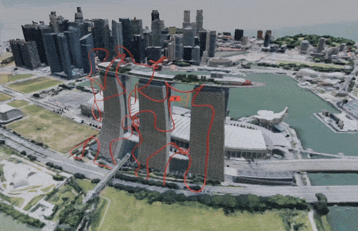
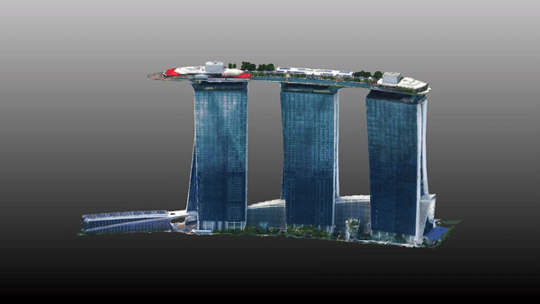
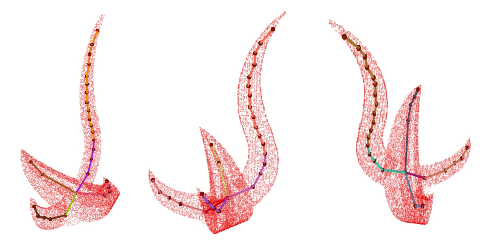
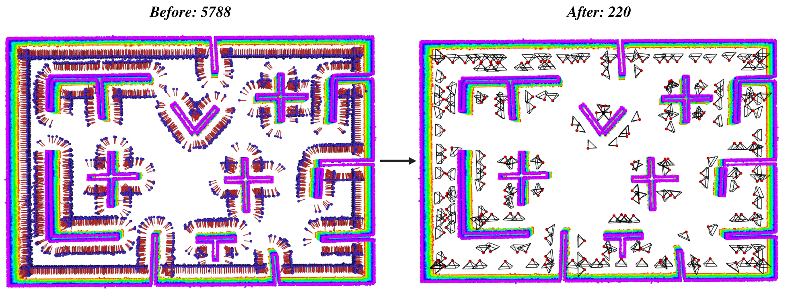
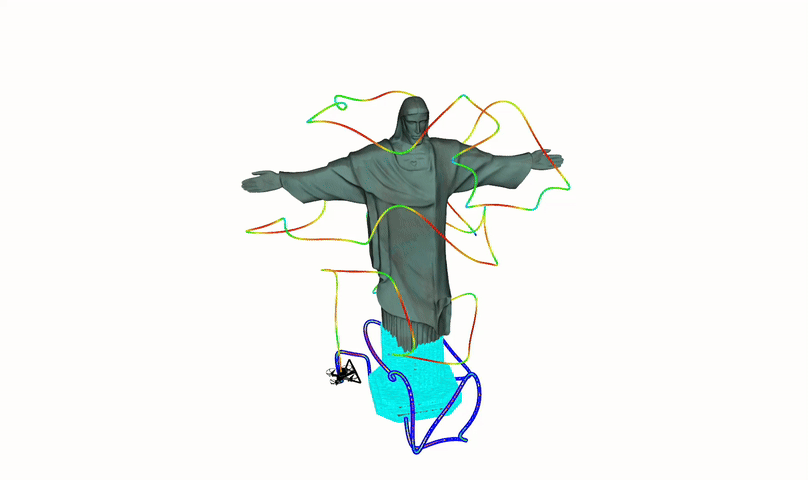

<div align="center">
    <h1>⚽ FC-Planner</h1>
    <h2>A Skeleton-guided Planning Framework for Fast Aerial Coverage of Complex 3D Scenes</h2>
    <strong>ICRA 2024</strong> <strong style="color: red;">Best UAV Paper Award Finalist</strong>
    <br>
        <a href="https://chen-albert-feng.github.io/AlbertFeng.github.io/" target="_blank">Chen Feng</a><sup>2</sup>,
        <a href="https://uav.hkust.edu.hk/current-members/" target="_blank">Haojia Li</a><sup>2</sup>,
        <a href="http://sysu-star.com/people/" target="_blank">Mingjie Zhang</a><sup>1</sup>,
        <a href="https://uav.hkust.edu.hk/current-members/" target="_blank">Xinyi Chen</a><sup>2</sup>,
        <a href="http://sysu-star.com/people/" target="_blank">Boyu Zhou</a><sup>1,†</sup>, and
        <a href="https://uav.hkust.edu.hk/group/" target="_blank">Shaojie Shen</a><sup>2</sup>
    <p>
        <h45>
            <sup>1</sup>SYSU STAR Group &nbsp;&nbsp;
            <sup>2</sup>HKUST Aerial Robotics Group &nbsp;&nbsp;
            <br>
        </h5>
        <sup>†</sup>Corresponding Author
    </p>
    <a href='https://arxiv.org/pdf/2309.13882.pdf'></a>
    <a href='https://hkust-aerial-robotics.github.io/FC-Planner/'></a>
    <a href="https://www.youtube.com/watch?v=U-X4OddXI88"></a>
    <a href="https://www.bilibili.com/video/BV1Fr421j7oC/?spm_id_from=333.999.0.0&vd_source=0af61c122e5e37c944053b57e313025a"></a>
</div>

## 📢 News

* **[30/06/2024]**: FC-Hetero is accepted to IROS 2024 and selected as **oral presentation** (acceptance rate: 10%). 
* **[16/05/2024]**: FC-Planner is selected as the **finalist** for ICRA 2024 **Best UAV Paper Award**.
* **[02/05/2024]**: All code of FC-Planner is released.
* **[15/03/2024]**: FC-Planner is extended to multi-UAV autonomous reconstruction as FC-Hetero, check this [repo](https://github.com/SYSU-STAR/FC-Hetero) for details.
* **[29/01/2024]**: FC-Planner is accepted to ICRA 2024.

## 📜 Introduction

**[ICRA'24]** This repository maintains the implementation of "FC-Planner: A Skeleton-guided Planning Framework for Fast Aerial Coverage of Complex 3D Scenes".

<p align="center">
  
  
</p>

**FC-Planner** is a highly efficient planning framework tailored for fast coverage of large and complex 3D scenes. Both the simulation and real-world experiments demonstrate the superior system simplicity and performance of our method compared to state-of-the-art ones.

Please cite our paper if you use this project in your research:
* [FC-Planner: A Skeleton-guided Planning Framework for Fast Aerial Coverage of Complex 3D Scenes](https://arxiv.org/pdf/2309.13882.pdf), Chen Feng, Haojia Li, Mingjie Zhang, Xinyi Chen, Boyu Zhou, and Shaojie Shen, 2024 IEEE International Conference on Robotics and Automation (ICRA).

```
@article{feng2023fc,
  title={FC-Planner: A Skeleton-guided Planning Framework for Fast Aerial Coverage of Complex 3D Scenes},
  author={Feng, Chen and Li, Haojia and Jiang, Jinqi and Chen, Xinyi and Shen, Shaojie and Zhou, Boyu},
  journal={arXiv preprint arXiv:2309.13882},
  year={2023}
}
```

Please kindly star ⭐️ this project if it helps you. We take great efforts to develop and maintain it 😁.

## 🛠️ Installation

**Prerequisite:**
* ROS Noetic (Ubuntu 20.04) or ROS Melodic (Ubuntu 18.04)
* PCL 1.7+ (1.10.0 Recommended)
* Eigen 3.4+ ([3.4.1](https://hkustconnect-my.sharepoint.com/:u:/g/personal/cfengag_connect_ust_hk/ES7krJtO3E1Oh4wY0-Wcr-gBDZ3dWz9bpbFNKp6Yhpn3Yg?e=mfiKrO) Recommended)
* Boost 1.71.0
```shell
  sudo apt update
  sudo apt install cpufrequtils
  sudo apt install libompl-dev
```

The project has been tested on Ubuntu 20.04 LTS (ROS Noetic) and Ubuntu 18.04 LTS (ROS Melodic). Directly clone our package (using ssh here):

**1) caktin tools (Recommended)**
```shell
  git clone git@github.com:HKUST-Aerial-Robotics/FC-Planner.git
  cd FC-Planner
  catkin config -DCMAKE_BUILD_TYPE=Release
  catkin build --cmake-args -Wno-dev
  cd src/hierarchical_coverage_planner/solution/LKH
  make
```
If you have installed ***Anaconda***, please use ```catkin build --cmake-args -Wno-dev -DPYTHON_EXECUTABLE=/usr/bin/python3```.
Tips: You can use ```ccache``` to accelerate compilation.
```shell
sudo apt-get install ccache
catkin config --cmake-args -DCMAKE_BUILD_TYPE=Release -DCMAKE_C_COMPILER_LAUNCHER=ccache -DCMAKE_CXX_COMPILER_LAUNCHER=ccache
catkin build --continue-on-failure
```

**2) caktin make**
```shell
  git clone git@github.com:HKUST-Aerial-Robotics/FC-Planner.git
  cd FC-Planner
  catkin config -DCMAKE_BUILD_TYPE=Release
  catkin_make --cmake-args -Wno-dev
  cd src/hierarchical_coverage_planner/solution/LKH
  make
```
If you have installed ***Anaconda***, please use ```catkin_make --cmake-args -Wno-dev -DPYTHON_EXECUTABLE=/usr/bin/python3```.

## 🚀 Quick Start

Run ```Rviz``` for coverage flight visualization and open another terminal for running the simulation:
```shell
sudo cpufreq-set -g performance
cd FC-Planner
source devel/setup.zsh && roslaunch hierarchical_coverage_planner rviz.launch
source devel/setup.zsh && roslaunch hierarchical_coverage_planner mbs.launch
```
Trigger the quadrotor to start planning by the ``2D Nav Goal``, then ``2D Pose Estimate`` to start coverage flight as shown in the left gif. More scenes are provided in ```src/hierarchical_coverage_planner/launch```
<p align="center">
  
  
</p>

Afterwards, you will obtain the discrete trajectory in ```src/hierarchical_coverage_planner/solution/Traj/TrajInfoMBS.txt```. You can use this coverage trajectory to capture the images of the target, and then reconstruct it. The detailed step can be found in [vis tool doc](./FC-Planner/vis_tool/README.md). The reconstruction result is depicted in the right gif.

#### • Use in Your Application

If you have successfully run the simulation and want to use FC-Planner in your project, please explore the launch files in ```src/hierarchical_coverage_planner/launch```. Important parameters that may be changed in your usage. Notably, FC-Planner accepts ***surface point cloud*** as input, so you may be careful about the type of your data.

#### • Information of Your Device
When you run the launch file, you will see detailed environment of your platform at the beginning of terminal outputs, *e.g.*,
```
------------------------YOUR DEVICE INFO------------------------
Project        : FC-Planner
Author         : Chen Feng
Current Time   : Sat Jun 22 19:40:05 2024
CPU Info       : 12th Gen Intel(R) Core(TM) i9-12900K
RAM Info       : 31.14GB Physical Memory, 2.00GB Virtual Memory
OS Info        : Linux 5.15.0-107-generic (x86_64)
GCC Version    : 9.4.0
Eigen Version  : 3.4.1
PCL Version    : 1.10.0
Boost Version  : 1.71.0
----------------------------------------------------------------
```

## 🔌 Plug-in Packages

For the benefit of the community, we modularize the whole project and extract two important functions (space decomposition and viewpoint generation) as plug-in packages for your use.

#### • Skeleton-based Space Decomposition (SSD)

The individual package of SSD is given for your purposeful usage, where some example scenes are provided in ```src/rosa/launch```.

Run ```Rviz``` for SSD visualization and open another terminal for SSD execution:
```shell
sudo cpufreq-set -g performance
cd FC-Planner
source devel/setup.zsh && roslaunch rosa rviz.launch
source devel/setup.zsh && roslaunch rosa ${SCENE}.launch (e.g., redbird.launch)
```

Afterwards, you will see the SSD results of HKUST RedBird in your ```Rviz``` as follows:
<p align="center">
  
</p>

As for your ***customerized scene*** and ***more details***, you can find in [rosa package doc](FC-Planner/src/rosa/README.md). 

#### • Iterative Updates of Viewpoint Pose

Here we provide an independent package of finding the minimal viewpoint set for a given area needed to cover, *i.e.*, our proposed ***Iterative Updates of Viewpoint Pose***.

Specifically, we give a 3D case guided by skeleton. Run ```Rviz``` for visualization and open another terminal for viewpoint generation execution:
```shell
sudo cpufreq-set -g performance
cd FC-Planner
source devel/setup.zsh && roslaunch viewpoint_manager rviz.launch
source devel/setup.zsh && roslaunch viewpoint_manager mbs.launch
```

Afterwards, you will see the viewpoint generation results of Marina Bay Sands in your ```Rviz``` as follows:
<p align="center">
  
</p>

You can also use other guidance to generate viewpoints, *e.g.*, normals. For example, we give a 2.5D case (indoor office) using normal guidance to generate viewpoints.
```shell
sudo cpufreq-set -g performance
cd FC-Planner
source devel/setup.zsh && roslaunch viewpoint_manager rviz_normal.launch
source devel/setup.zsh && roslaunch viewpoint_manager normal.launch
```

Afterwards, you will see the viewpoint generation results of this 2.5D case in your ```Rviz``` as follows:
<p align="center">
  
</p>

For more usage details, you can find in [viewpoint manager doc](./FC-Planner/src/viewpoint_manager/README.md). 

## 🎮 Demo

<p align="center">
  
  
  
  
</p>
<p align="center">
  
</p>
Since ICRA2024 is held in Pacifico, Yokohama, we specially prepared a demo reconstructing Pacifico center for the conference, as shown in below.
<p align="center">
  
</p>

## 🤗 FC-family Works

* [PredRecon](https://github.com/HKUST-Aerial-Robotics/PredRecon) (ICRA2023): Prediction-boosted Planner for Aerial Reconstruction.
* [FC-Planner](https://github.com/HKUST-Aerial-Robotics/FC-Planner) (ICRA2024): Highly Efficient Global Planner for Aerial Coverage.
* [FC-Hetero](https://github.com/SYSU-STAR/FC-Hetero) (IROS2024): Heterogenous Multi-UAV Planner for Aerial Reconstruction.
